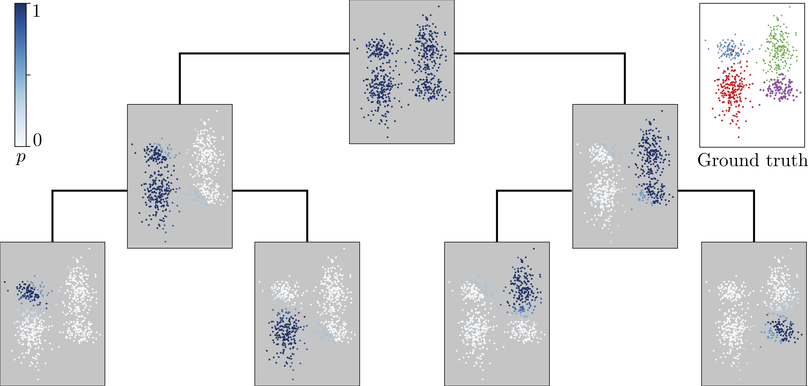
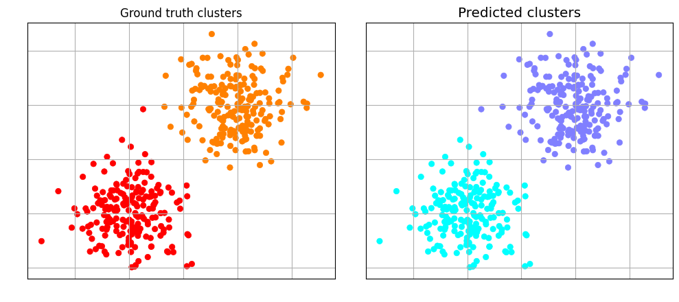
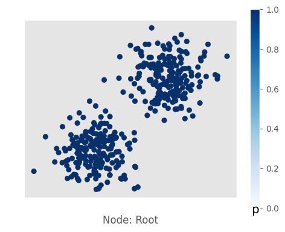
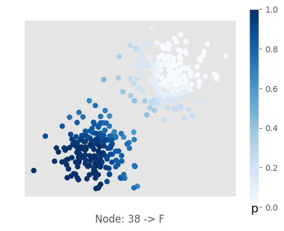
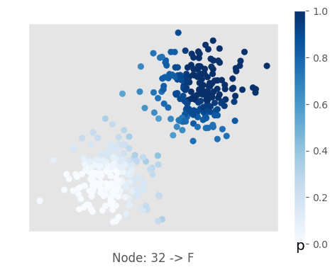

# Welcome to the tangles Package!

[](https://opensource.org/licenses/MIT)


<p align="center">
  
</p>

This is a python package for data clustering using the tangles algorithmic framework. 

It implements the core algorithm to discover tangles in a set of cuts on a given dataset.

It includes some pre- and postprocessing implementations: options to compute initial cuts on different types of data, and options to postprocess tangles to hierarchical soft and hard clustering. 

The framework works with arbitrary sets of cuts and cost functions and can be adapted or implemented manually. The heuristics for finding tangles as well as the derivation of the cluster assignments is task dependent and should be chosen with domain knowledge.

For demonstrations for three types of data: graphs, binary questionnaires and metric data, see the demo folder.


## Setup

Download the repository. 

Navigate to the tangles directory and install the package using

```
pip install .
```

## A Simple Example

Imports
```python
from tangles import cost_functions, data_types, plotting, loading, cut_finding, utils, tree_tangles
```

Load your data

```python
xs, ys = loading.load_GMM(blob_sizes=[200, 200], blob_centers=[[-2, -2], [2, 2]], blob_variances=[[1, 1], [1, 1]], seed=42)
data = data_types.Data(xs=xs, ys=ys)
```

Compute cuts

```python
values, names = cut_finding.a_slice(xs=data.xs, a=20)
bipartitions = data_types.Cuts(values=values, names=names)
```

Define a cost function and order cuts
```python 
cost_fun = cost_functions.gauss_kernel_distance
bipartitions = utils.compute_cost_and_order_cuts(bipartitions, partial(cost_fun, data.xs, None))
```

```Computing costs of cuts... ```

```100%|█████████████████████████████████████████| 42/42 [00:00<00:00, 1382.53it/s]```

Invoke core algorithm to compute tree of all tangles

```python
tangles_tree = tree_tangles.tangle_computation(cuts=bipartitions,
                                               agreement=20,
                                               verbose=0
                                               )
```

Contract the tree to necessary information

```python
contracted_tree = tree_tangles.ContractedTangleTree(tangles_tree)
contracted_tree.prune(5)
```

Compute soft cluster assignments

```python
contracted_tree.calculate_setP()

#weight cuts by their cost
weight = np.exp(-utils.normalize(bipartitions.costs))

# propagate down the tree
tree_tangles.compute_soft_predictions_children(node=contracted_tree.root,
                                  cuts=bipartitions,
                                  weight=weight,
                                  verbose=3)

contracted_tree.processed_soft_prediction = True
```

Derive hard clustering from soft assignments

```python
ys_predicted, _ = utils.compute_hard_predictions(contracted_tree, cuts=bipartitions)
```

Calculate performance given the ground truth clusters

```python
ARS = sklearn.metrics.adjusted_rand_score(data.ys, ys_predicted)
NMI = sklearn.metrics.normalized_mutual_info_score(data.ys, ys_predicted)

print('Adjusted Rand Score: {}'.format(np.round(ARS, 4)), flush=True)
print('Normalized Mutual Information: {}'.format(np.round(NMI, 4)), flush=True)
```

```Adjusted Rand Score: 0.99```

```Normalized Mutual Information: 0.9773```

If we have a low dimensional embedding we can vizualise the hard and soft clustering:
```python
plotting.plot_hard_predictions(data=data, ys_predicted=ys_predicted, path=None)
```

<p align="center">
  
</p>


```python
plotting.plot_soft_predictions(data=data,
                               contracted_tree=contracted_tree,
                               eq_cuts=bipartitions.equations,
                               path=None)
```

<p align="center">
  
</p>

<p align="center">
  
  
</p>


## Overview of the package

### Definig heuristics to compute bipartitions

The framework needs a set of cuts as input. Based on these and the datapoints the algorithm discovers the tangles that is cohesive structures in the datas.
In tangles/cut_finding, some basic implementations are given. If the data allows for a natural interpretaion of cuts (as a binary questionnaire) we do not need this preprocessing step.
A cut finding method needs to return an array of boolean arrays of bipartitions, optionally it can return names of the bipartitions for interpretable output, else return None.

__Parameters:   &nbsp; xs : *ndarray*__

&nbsp; &nbsp; &nbsp; &nbsp; &nbsp; &nbsp; &nbsp; &nbsp; &nbsp; &nbsp; &nbsp; &nbsp; &nbsp; &nbsp;
data matrix on which the cuts shall be computed

&nbsp; &nbsp; &nbsp; &nbsp; &nbsp; &nbsp; &nbsp; &nbsp; &nbsp; &nbsp; &nbsp; &nbsp;
__\*\*kwargs__

__Returns:  &nbsp; cuts &nbsp;&nbsp;&nbsp;&nbsp;: *ndarray,*__ *type: bool*

&nbsp; &nbsp; &nbsp; &nbsp; &nbsp; &nbsp; &nbsp; &nbsp; &nbsp; &nbsp; &nbsp; &nbsp; &nbsp; &nbsp;
array of boolean arrays of cuts

&nbsp; &nbsp; &nbsp; &nbsp; &nbsp; &nbsp; &nbsp; &nbsp; &nbsp;
__names : *ndarray,*__ *type: string, __optional__*

&nbsp; &nbsp; &nbsp; &nbsp; &nbsp; &nbsp; &nbsp; &nbsp; &nbsp; &nbsp; &nbsp; &nbsp; &nbsp; &nbsp;
optionally return an array with corresponding names for the explanation of the output


### Definig cost functions

The cost function implicitly defines the similarity measure between two objects from the dataset and thus introduces an important bias. It will the definition of close objects and the cluster structure of the output.
Given the dataset and a cut the cost function returns a real value assigning a score representing the usefulness. High values indicate low informational content, little use. Low values indicate useful cuts. 
Some predefined cost functions are given tangles/cost_function.py, task and data dependent cost function can help improve the performance.  


__Parameters:   &nbsp; xs : *ndarray*__

&nbsp; &nbsp; &nbsp; &nbsp; &nbsp; &nbsp; &nbsp; &nbsp; &nbsp; &nbsp; &nbsp; &nbsp; &nbsp; &nbsp;
data matrix $n \times d$ with $n$ datapoints and $d$ features dimension

&nbsp; &nbsp; &nbsp; &nbsp; &nbsp; &nbsp; &nbsp; &nbsp; &nbsp; &nbsp; &nbsp; &nbsp;
__cut : *ndarray*__ 

&nbsp; &nbsp; &nbsp; &nbsp; &nbsp; &nbsp; &nbsp; &nbsp; &nbsp; &nbsp; &nbsp; &nbsp; &nbsp; &nbsp;
bool array of length $n$ indication a bipartition

&nbsp; &nbsp; &nbsp; &nbsp; &nbsp; &nbsp; &nbsp; &nbsp; &nbsp; &nbsp; &nbsp; &nbsp;
__\*\*kwargs__

__Returns:  &nbsp; cuts &nbsp;&nbsp;&nbsp;&nbsp;: *float*__

&nbsp; &nbsp; &nbsp; &nbsp; &nbsp; &nbsp; &nbsp; &nbsp; &nbsp; &nbsp; &nbsp; &nbsp; &nbsp; &nbsp;
cost of the cut

&nbsp; &nbsp; &nbsp; &nbsp; &nbsp; &nbsp; &nbsp; &nbsp; &nbsp; &nbsp; &nbsp; &nbsp; &nbsp; &nbsp;
optionally return an array with corresponding names for the explanation of the output

### Postprocessing tangles

The output of the core algorithm is the tangle search tree holding all tangle infromation about the data. There are several options to aggregate the information to clustering and to interpret the output.
If domain knowledge is given then the given heuristics might be improvable.


## Citing tangles

If you use this software in your research, we encourage you to cite our paper.

```bib
@article{DBLP:journals/corr/abs-2006-14444,
  title={Tangles: From Weak to Strong Clustering},
  author={Solveig Klepper and
            Christian Elbracht and
            Diego Fioravanti and
            Jakob Kneip and
            Luca Rendsburg and
            Maximilian Teegen and
            Ulrike von Luxburg},
  url = {https://arxiv.org/abs/2006.14444},
  publisher = {arXiv},
  year = {2020},
}
```
